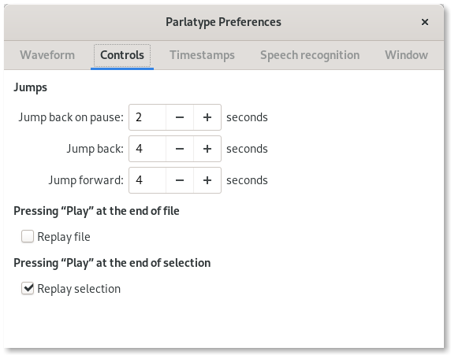
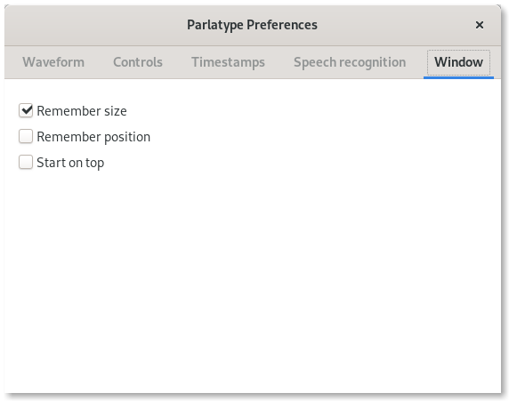

# Parlatype

## What is it?

Parlatype is a minimal audio player for manual speech transcription, written for the GNOME desktop environment. It plays audio sources to transcribe them in your favourite text application.


 You can control the speed of playback, playing slowly as you type, playing fast for editing. The pitch is not altered, there is no “chipmunk” effect. Whenever you pause playback, it will rewind a few seconds, so that you can easier resume. Of course you can change how much it rewinds or whether it rewinds at all.

Parlatype can start on top of other windows. If you are working with a maximized text application, you can still see the Parlatype window.




Parlatype can be controlled with the “Play” button from your multimedia keyboard. This way it doesn’t have to have focus to control it. You can type in your text application and still have some (basic) control over Parlatype.

A powerful feature of Parlatype is a set of LibreOffice helpers (macros). For example you can insert a time stamp into your document with a shortcut of your choice. If you put the cursor on such a time stamp and use another shortcut, Parlatype will jump to that position.


## What it’s not

Parlatype is just an audio player, you still need another program, where you write your transcription to, e.g. LibreOffice. It doesn’t work with videos or streaming media. It’s not a tool for scientific transcription, rather for your personal use. There is no speech recognition, you have to type yourself.

## Translations

Parlatype is fully translatable, currently there is an English and a German version. Any help in translations is welcome, please leave a message, if you’re willing to contribute.

## Installation

### Packages

In the release section you’ll find packages for
* Ubuntu 14.04 “Trusty”
* Ubuntu 16.04 “Xenial”
* Debian 8 “Jessie”

Choose your distro and architecture (amd64 or i386) and that’s it. The package with the LibreOffice helpers is architecture independent.

### Dependencies

To install Parlatype from source you need the basic building infrastructure with make, autotools, intltool and yelp-tools and finally libgtk-3 (minimum version 3.10) and libgstreamer1.0 with base plugins.

On a Debian based distro you can install these with:

```
$ sudo apt-get install build-essential automake autoconf intltool yelp-tools libgtk-3-dev libgstreamer1.0-dev libgstreamer-plugins-base1.0-dev
```

In order to run it needs at least Gtk+ 3.10 and GStreamer 1.0 with the set of “good” plugins.
The Debian based command is (but you probably have them already):
```
$ sudo apt-get install libgtk-3-0 libgstreamer1.0-0 gstreamer1.0-plugins-good
```

### Building 
Building from git requires running autogen.sh:
```
$ git clone https://github.com/gkarsay/parlatype.git
$ cd parlatype
$ ./autogen.sh
$ make
$ sudo make install
```
Building from tarball: Download a release tarball, extract it and run:
```
$ autoreconf # might be necessary
$ ./configure
$ make
$ sudo make install
```

### LibreOffice helpers
The LibreOffice helpers/macros are installed together with Parlatype.
However, this works only fine with
```
$ ./configure --prefix=/usr
```
If you use a different prefix, it’s recommended to
```
$ ./configure --without-lo
```
In the latter case, please copy the macros manually:
```
$ sudo cp libreoffice/Parlatype.py /usr/lib/libreoffice/share/Scripts/python/
```
If you don’t want to install them system-wide, you can put them in your home dir instead:
```
$ cp libreoffice/Parlatype.py ~/.config/libreoffice/4/user/Scripts/python/
```


## Credits

The idea and initial design of Parlatype is based on Frederik Elwert’s program *transcribe*. I used it a lot as long as it was maintained.

The display of the audio wave form is based on *Buzztrax*. I probably wouldn't have managed to realize this feature without using and modifying that code.

The icon is based on work from the GNOME team.

